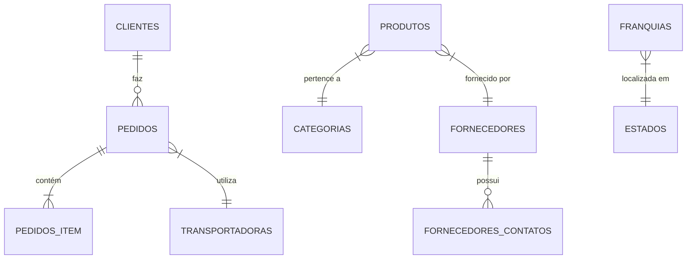

# 📊 Sistema de Gerenciamento  Café


---

## 🌐 Visão Geral

O banco de dados é um sistema completo para gestão de redes de cafeterias desenvolvido como projeto acadêmico.

**Principais funcionalidades:**
- ✅ Cadastro de produtos e categorias
- ✅ Gestão de clientes com múltiplos níveis de acesso
- ✅ Processamento completo de pedidos
- ✅ Controle de estoque e fornecedores
- ✅ Relatórios de faturamento por franquia

> **Curso:** Desenvolvimento Web com André Fontenelle (Certificado Adobe)

---

## 🔍 Diagrama do Banco



## Tabela `clientes`

| Campo            | Tipo         | Descrição                           | Restrições                     | Exemplo                |
|------------------|--------------|-------------------------------------|--------------------------------|------------------------|
| `clienteID`      | INT(8)       | Identificador único do cliente      | PRIMARY KEY, AUTO_INCREMENT    | 7                      |
| `nomecompleto`   | VARCHAR(50)  | Nome completo do cliente            | NOT NULL                       | "João Silva"           |
| `endereco`       | VARCHAR(50)  | Endereço principal                  |                                | "Av. Paulista, 1000"   |
| `complemento`    | VARCHAR(30)  | Complemento do endereço             |                                | "Apto 42"              |
| `numero`         | VARCHAR(15)  | Número do endereço                  |                                | "1000"                 |
| `cidade`         | VARCHAR(50)  | Cidade de residência                |                                | "São Paulo"            |
| `estadoID`       | TINYINT(3)   | FK para tabela de estados           |                                | 27 (SP)                |
| `cep`            | VARCHAR(10)  | CEP                                 |                                | "01310-100"            |
| `ddd`            | VARCHAR(3)   | DDD do telefone                     |                                | "11"                   |
| `telefone`       | VARCHAR(10)  | Número de telefone                  |                                | "999887766"            |
| `email`          | VARCHAR(50)  | Endereço de e-mail                  | UNIQUE                         | "cliente@email.com"    |
| `usuario`        | VARCHAR(10)  | Nome de usuário para login          | UNIQUE                         | "joaosilva"            |
| `senha`          | VARCHAR(10)  | Senha de acesso (deveria ser hash)  |                                | "123456"               |
| `nivel`          | VARCHAR(10)  | Nível de acesso                     | DEFAULT 'user'                 | "admin", "user"        |

**Chaves:**
- PRIMARY KEY: `clienteID`
- FOREIGN KEY: `estadoID` referencia `estados(estadoID)`

**Exemplo de INSERT:**
```sql
INSERT INTO clientes (
  nomecompleto, endereco, cidade, estadoID, 
  email, usuario, senha, nivel
) VALUES (
  'Maria Oliveira', 'Rua das Flores, 123', 'Rio de Janeiro', 22,
  'maria@email.com', 'maria', 'senha123', 'user'
);
